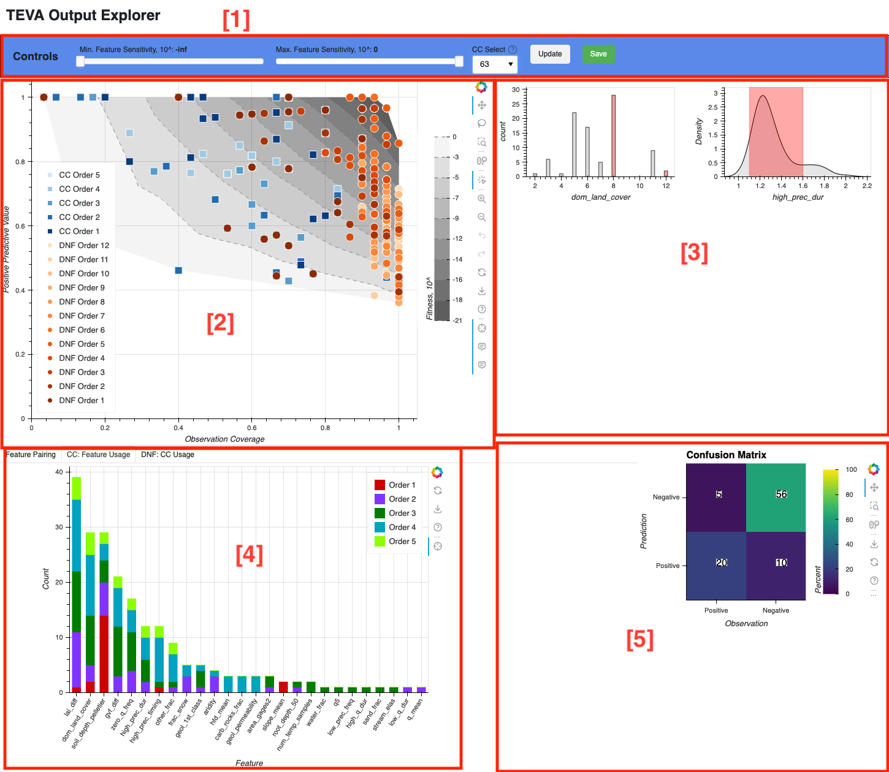
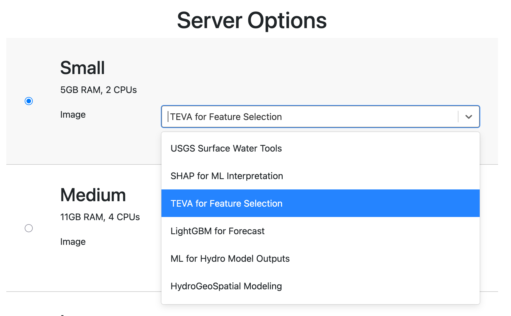

# **Welcome to the TEVA Output Explorer!**
*Python dashboard for viewing and interacting with the outputs of the TEVA algorithm.*

*Notebook and supporting .py  scripts by Ryan van der Heijden | rvanderh@uvm.edu*
#

### Components
`TEVA_Output_Explorer.ipynb` is the main notebook and manages importing the TEVA output files, running some post-processing functions, setting up plot interactivity, and constructing the dashboard. It depends on two supporting files `TEVA_Post_Processing.py` and `TEVA_Dynamic_Plotting.py`.

`TEVA_Post_Processing.py` contains the post-processing functions that transform the .xlsx file output from TEVA into several more informative and user-friendly data structures. These data structures are used to generate the interactive plots.

`TEVA_Dynamic_Plotting.py` contains functions for plotting the various results of the post-processing functions and handling figure updates when the user interacts with the dashboard controls.

Examples of TEVA output files and observation data are included in the `Sample_Data` folder.

### About the notebook

**The `TEVA_Output_Explorer.ipynb` notebook is divided into six sections:**
1. Import dependencies
2. Import TEVA output files and observation data
3. Run post-processing functions
4. Dashboard support
5. Dashboard interactivity
6. Dashboard layout

**The dashboard has five main components:**
1. Controls
    - Minimum and maximum sensitivity sliders
    - CC selector for CC feature subplots
    - "Update" button to update tabbed plots
    - "Save" button to export dashboard as a .html file
2. PPV vs. COV plot
3. CC feature subplots
4. Tabbed plots
    - Feature pairing
    - Features used in CCs
    - CCs used in DNFs
5. Confusion matrix for selected CC

  
# CIROH 2i2c Setup
1. Navigate to CIROH 2i2c hub and log in `https://workshop.ciroh.awi.2i2c.cloud/hub/spawn`. From the dropdown for the "Small" server option, select `TEVA for Feature Selection`. Start your server.

2. From the menu bar, create a new folder and title it something relevant, such as `TEVA DevCon` or something similar.

3. Select the folder, and open a new terminal. Clone the workshop repository:

`git clone https://github.com/Ryan-vanderHeijden/TEVA_DevCon2025.git`

4. Now you're ready to go!

##
Once you are finished, make sure to shut down your server: ([Instructions for shutting off server](https://www.youtube.com/watch?v=VSFs2bu4-74&feature=youtu.be))

